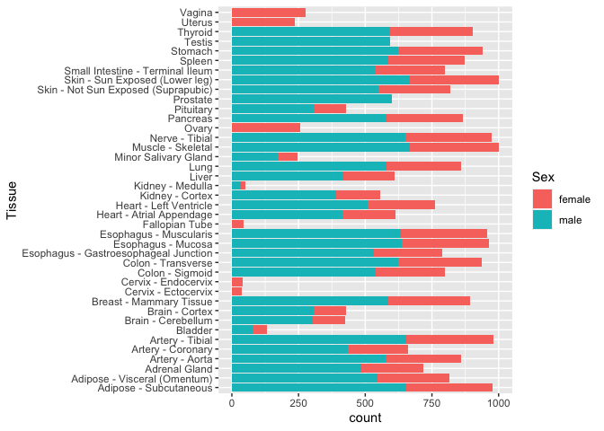
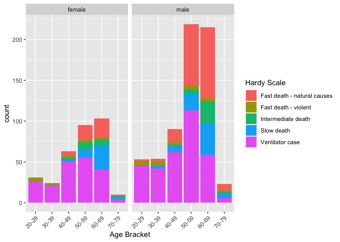
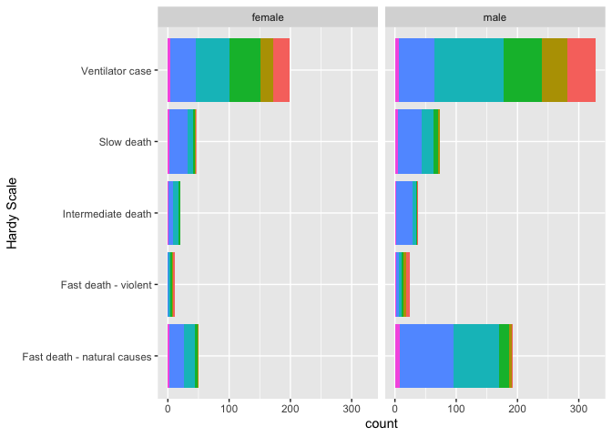

    library(tidyverse)

    ## ── Attaching packages ─────────────────────────────────────── tidyverse 1.3.1 ──

    ## ✓ ggplot2 3.3.5     ✓ purrr   0.3.4
    ## ✓ tibble  3.1.6     ✓ dplyr   1.0.7
    ## ✓ tidyr   1.1.4     ✓ stringr 1.4.0
    ## ✓ readr   2.1.1     ✓ forcats 0.5.1

    ## ── Conflicts ────────────────────────────────────────── tidyverse_conflicts() ──
    ## x dplyr::filter() masks stats::filter()
    ## x dplyr::lag()    masks stats::lag()

    library(kableExtra)

    ## 
    ## Attaching package: 'kableExtra'

    ## The following object is masked from 'package:dplyr':
    ## 
    ##     group_rows

    df <- read_csv("../data/GTExPortal.csv")

    ## Rows: 25713 Columns: 8

    ## ── Column specification ────────────────────────────────────────────────────────
    ## Delimiter: ","
    ## chr (8): Tissue Sample ID, Tissue, Subject ID, Sex, Age Bracket, Hardy Scale...

    ## 
    ## ℹ Use `spec()` to retrieve the full column specification for this data.
    ## ℹ Specify the column types or set `show_col_types = FALSE` to quiet this message.

    dim(df)

    ## [1] 25713     8

    head(df) 

    ## # A tibble: 6 × 8
    ##   `Tissue Sample ID` Tissue       `Subject ID` Sex   `Age Bracket` `Hardy Scale`
    ##   <chr>              <chr>        <chr>        <chr> <chr>         <chr>        
    ## 1 GTEX-1117F-0126    Skin - Sun … GTEX-1117F   fema… 60-69         Slow death   
    ## 2 GTEX-1117F-0226    Adipose - S… GTEX-1117F   fema… 60-69         Slow death   
    ## 3 GTEX-1117F-0326    Nerve - Tib… GTEX-1117F   fema… 60-69         Slow death   
    ## 4 GTEX-1117F-0426    Muscle - Sk… GTEX-1117F   fema… 60-69         Slow death   
    ## 5 GTEX-1117F-0526    Artery - Ti… GTEX-1117F   fema… 60-69         Slow death   
    ## 6 GTEX-1117F-0626    Artery - Co… GTEX-1117F   fema… 60-69         Slow death   
    ## # … with 2 more variables: Pathology Categories <chr>, Pathology Notes <chr>

    df %>%
      ggplot(aes(x = `Tissue`, 
                 fill = `Sex`)) +
      geom_bar()  

    df %>%
      ggplot(aes(x = `Tissue`, 
                 fill = `Sex`)) +
      geom_bar()  +
      coord_flip()

    df2 <- df %>% 
      group_by(`Subject ID`, `Hardy Scale`, `Age Bracket`, Sex) %>%
      summarize(TissueCount = length(Tissue)) %>%
      arrange(desc(TissueCount))  

    ## `summarise()` has grouped output by 'Subject ID', 'Hardy Scale', 'Age Bracket'. You can override using the `.groups` argument.

    head(df2, 10) 

    ## # A tibble: 10 × 5
    ## # Groups:   Subject ID, Hardy Scale, Age Bracket [10]
    ##    `Subject ID` `Hardy Scale`               `Age Bracket` Sex    TissueCount
    ##    <chr>        <chr>                       <chr>         <chr>        <int>
    ##  1 GTEX-12WSG   Ventilator case             50-59         female          36
    ##  2 GTEX-1ICG6   Ventilator case             70-79         female          36
    ##  3 GTEX-11ZTT   Ventilator case             60-69         female          35
    ##  4 GTEX-14A6H   Ventilator case             30-39         male            35
    ##  5 GTEX-12WSN   Ventilator case             40-49         male            34
    ##  6 GTEX-131XF   Ventilator case             60-69         male            34
    ##  7 GTEX-15EOM   Ventilator case             20-29         female          34
    ##  8 GTEX-1117F   Slow death                  60-69         female          33
    ##  9 GTEX-11EMC   Fast death - natural causes 60-69         female          33
    ## 10 GTEX-11ZTS   Fast death - natural causes 60-69         female          33

    dim(df2)

    ## [1] 980   5

    df2 %>%
      ggplot(aes(fill = `Hardy Scale`, 
                 x = `Age Bracket`)) +
      geom_bar() +
      facet_wrap(~Sex) +
      theme(axis.text.x =  element_text(angle = 45, hjust = 1))

    df3 <- df2 %>%
      group_by(`Hardy Scale`, `Age Bracket`, Sex) %>%
      summarise(count = length(`Subject ID`)) 

    ## `summarise()` has grouped output by 'Hardy Scale', 'Age Bracket'. You can override using the `.groups` argument.

    tail(df3,20) 

    ## # A tibble: 20 × 4
    ## # Groups:   Hardy Scale, Age Bracket [10]
    ##    `Hardy Scale`   `Age Bracket` Sex    count
    ##    <chr>           <chr>         <chr>  <int>
    ##  1 Slow death      40-49         female     3
    ##  2 Slow death      40-49         male       8
    ##  3 Slow death      50-59         female     9
    ##  4 Slow death      50-59         male      20
    ##  5 Slow death      60-69         female    29
    ##  6 Slow death      60-69         male      38
    ##  7 Slow death      70-79         female     3
    ##  8 Slow death      70-79         male       5
    ##  9 Ventilator case 20-29         female    26
    ## 10 Ventilator case 20-29         male      45
    ## 11 Ventilator case 30-39         female    21
    ## 12 Ventilator case 30-39         male      42
    ## 13 Ventilator case 40-49         female    50
    ## 14 Ventilator case 40-49         male      62
    ## 15 Ventilator case 50-59         female    56
    ## 16 Ventilator case 50-59         male     113
    ## 17 Ventilator case 60-69         female    41
    ## 18 Ventilator case 60-69         male      59
    ## 19 Ventilator case 70-79         female     4
    ## 20 Ventilator case 70-79         male       6

    df4 <- df3 %>%
      pivot_wider(names_from = `Age Bracket`,
                  values_from = `count`)
    df4 

    ## # A tibble: 10 × 8
    ## # Groups:   Hardy Scale [5]
    ##    `Hardy Scale`           Sex   `20-29` `30-39` `40-49` `50-59` `60-69` `70-79`
    ##    <chr>                   <chr>   <int>   <int>   <int>   <int>   <int>   <int>
    ##  1 Fast death - natural c… male        2       4      16      75      87       8
    ##  2 Fast death - natural c… fema…      NA       1       5      18      24       2
    ##  3 Fast death - violent    fema…       4       1       3       3       1      NA
    ##  4 Fast death - violent    male        5       5       3       5       4       2
    ##  5 Intermediate death      male        1      NA       1       6      27       2
    ##  6 Intermediate death      fema…      NA      NA       2       9       8       1
    ##  7 Slow death              fema…       1       1       3       9      29       3
    ##  8 Slow death              male       NA       3       8      20      38       5
    ##  9 Ventilator case         fema…      26      21      50      56      41       4
    ## 10 Ventilator case         male       45      42      62     113      59       6

    ggplot(df3, aes(x = `Hardy Scale`, y = count,
                    fill = `Age Bracket`,
                    label = count)) +
      geom_bar(stat = "identity") +
      facet_wrap(~`Sex`) +
      coord_flip() +
      theme(legend.position = "none")

    df5 <- df2 %>%
      group_by( `Age Bracket`) %>%
      summarise(count = length(`Age Bracket`)) 

    df5 

    ## # A tibble: 6 × 2
    ##   `Age Bracket` count
    ##   <chr>         <int>
    ## 1 20-29            84
    ## 2 30-39            78
    ## 3 40-49           153
    ## 4 50-59           314
    ## 5 60-69           318
    ## 6 70-79            33

    ggplot(df5, aes(x = `Age Bracket`, y = count,
                    fill = `Age Bracket`,
                    label = count)) +
      geom_bar(stat = "identity") +
      geom_text(aes(label = count)) +
      theme(legend.position = "none")

